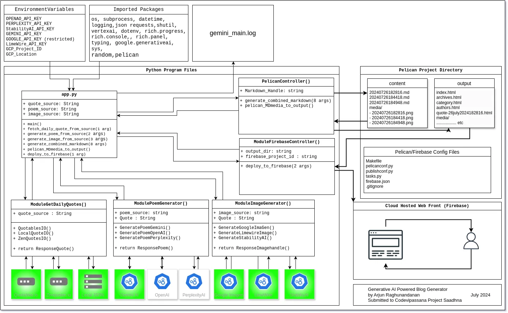

# GenAI-Powered-Daily-Quote-Blog-Generator

A GenAI based solution developed with Google Cloud Technologies as an idea submission for Code Vipaassana Project Saadhna 

## Overview

This project was developed as an idea entry shortlisted in for [Project Saadhna](https://rsvp.withgoogle.com/events/ps-2). This is my first time attending Project Saadhna.

### About Project Saadhna
>To empower selected Code Vipassana developers to lead and continuously engage in self-paced building with Google Cloud and leading more developers in the community to learn, build and grow. 
>
> *“Saadhna'' is a Sanskrit word which means to practice what you have learnt. Similarly, in this program, the activated developers from Code Vipassana seasons will practice their hands-on learning by continuously building with Google Cloud.*

### Goal

To provide users with a fresh, AI-generated poem and accompanying visual every day, inspired by a daily quote.

## Technology Stack

1. Google Cloud Platform (GCP): Google Cloud, Firebase, Cloud Run, Gemini Text Generation, Imagen2 Image Generation,  etc
2. Python, HTML, CSS, JS, JSON, DockerFile
3. Content Management System : Pelican
4. Daily Quote API : zenquotes io, quotables io, local json file
5. Poem Generation Options : Gemini 1.0 Pro , [ OpenAI text-davinci-003, Perplexity llama-3-sonar-large-32k-online ] pending test
6. Image Generation Options : Limewire API, Stability Stable Image Generator Core, Google Imagen imagegeneration@0006 model.

## Description of Post

Each post will contain:
> Date: Day, Month, Year  
> Quote of the Day: Sourced from a selected Daily Quote API  
> Poem of the Day: AI-generated using Gemini Vertex AI, inspired by the quote  
> Cover Image: AI-generated using Gemini Vertex AI, inspired by the quote  
> Disclaimers: Legal and AI-related disclaimers
> 
The project's backend could be powered by Google Cloud Functions, which will execute daily.  
The program will:
1.  Fetch the quote of the day from any Daily Quote API (or other services).
2.  Generate a cover image using Gemini AI (or other services) based on the quote.
3.  Generate a poem using Gemini Vertex AI (or other services) based on the quote.
4.  Create a blog post with the quote, poem, image, and date.
5.  convert it to web consumable format (html,css,js).
6.  Deploy the blog post to Hosting of choice. (Here we will use Firebase Hosting ).

## Progress of Project till now.

#### Version V0.1 : Starting Code

- HTML/CSS/JS from Scratch.
- post.js to modify index.html with {postname}.md files on load.
- No WebServer or Hosting Configured yet.

#### Version V1.0 : Getting Each Module Working

- Basic Individual Python Scripts to
    - Get Quote
    - Generate Poem
    - Generate Image
    - Generate MD File
    - Basic MDfile to HTML convertor directory for Pelican.
- Pelican output to Cloud Storage Mover Script.
- Hosting on Google Cloud Storage.

#### Version V2.0 : Single Entry Point Script for Terminal. app.py

- Switched to Firebase as Hosting.
- Included Extensibility options for each Step to use different services. Some are under progress.
- Combined Application for running {python app.py}
- Scripted Pelican creation, rebuilds on new run, deploying to Firebase with app.py
- Included Logs to audit app run and Errors.

* * *
CURRENT VERSION

#### Version V2.1 : Text User Interface. appTUI.py

- Introduced a very good looking Text User Interface 'appTUI.py' to make informed execution in each step.
- Asks which service to use for Quote, Poem, Image
- Reminds to set API_KEY
- Enabled VertexAI only for Imagen tasks
- Asks confirmations before running pelican export and firebase deployment.
- Parameterised 'app.py' Code
- merged functionalities of **appTUI.py** and Parameterized **app.py** into a unified **main.py**
- Further reduced error points with Exception handling. 
* * *

| Task        | Service           | Status  |Requirements|
| ------------- |:-------------:| -----:| -----:|
|Quote Generation|ZenQuotes.io|Code Fully Functional|No API Needed|
|Quote Generation|Quotables.io|Code Fully Functional|No API Needed|
|Quote Generation|Local Json File|Code Fully Functional|Locally Available|
|Poem Generation|Google AI Studio : Gemini|Code Fully Functional|AI Studio API Needed : Free|
|Poem Generation|OpenAI|Pending : Not Fully Tested : Disabled in Code|API Needed : Paid|
|Poem Generation|PerplexityAI|Pending : Not Fully Tested : Disabled in Code |API Needed : Paid|
|Image Generation|Google Imagen2|Code Fully Functional|API Needed : Restricted GA |
|Image Generation|LimeWire|Code Fully Functional|API Needed : Limited Free|
|Image Generation|StabilityAI Core|Code Fully Functional|API Needed : Limited Free|

Read Full PDF Report in this Github Repo Home Directory for further details. 

Project Diagram

## Updates : Additional Changes Made
### Section for updated changes outside of the main project idea if any.

|Date| Changes|
|---|---|
|28/07/2024|Started Working on Cloud Native Solution after Cloud Shell Quota Reset |
|29/07/2024|Started Private Github Repo to Host Project Files|
|29/07/2024|Dockerized the solution to run on Google Cloud Run|
|29/07/2024| Solution 1 : Successfully Serving Static Blog output on Firebase : {redacted}.web.app |
|29/07/2024|Solution 2 : Successfully Serving Static Files on Gunicorn at Cloud Run : {redacted}.a.run.app|
|29/07/2024|Introduced Basic Auth API POST Request function serving at {redacted}.a.run.app/generate|
|30/07/2024|Stripped down the project Files for Sharing on Github|

Version 3.0 Cloud Run POST Request Example : 
#### Using Curl
> curl -X POST -u admin:password -H "Content-Type: application/json" -d '{
> "quote_source": "QuotablesIO",
> "poem_source": "Gemini",
> "image_source": "LimewireImage"
> }' http://{redacted}.a.run.app/generate

##### Using Python Requests
> import requests
> url = 'http://{redacted}.a.run.app/generate'
> headers = {'Content-Type': 'application/json'}
> data = {
    "quote_source": "QuotablesIO",
    "poem_source": "Gemini",
    "image_source": "LimewireImage"
}
> response = requests.post(url, headers=headers, json=data, auth=('admin', 'password'))
> print(response.text)

## Disclaimers from Developer.

- There are non-google alternatives included to make the project more generalized. ( eg OpenAI,Perplexity for Poem Generation, LimeWire, StabilityAI for Image generation ) This was not an initial plan but was decided during development, This was done because my initial idea of Imagen was reliant on Google Imagen Team accepting my request to grant access to **Imagen on VertexAI** . Since this could be revoked at any time, It's good to have other options. If one breaks, you should still be able to use an alternative option. 
- This program is only developed to show learner project level application of generative AI to explore its capabilities and it does not necessarily encourage pushing bulk AI Generated content to spam the web.
- Live Version of project  will not be maintained after formal project period to avoid incurring run-time costs and service call quota limits. 
- Due to the Non-Deterministic Nature of Generative AI based content creation, There is always a high risk of posts generated with offensive message, visual, quotes. The developer is not reviewing each iteration of the generated post upon periodic deployment.
- Regardless of whether you are using Limewire's Image Generator, Google's Imagen, OpenAI's Dall-E, Always review your generated content before publishing them in a formal use-case. Never use this code 'as is' for production.   I have skipped the Per Post Review step for this project implementation. **This is an example of 'Do as I say, not as I do'.**
-  I made this in under 1 week with a lot of help from Documentations (see references at the end) and with Google Cloud Code Assist. There may still be errors or future dependency breakdown and this application is not fully error proof when all service options are unavailable.
- Some parts of the program are partially developed and may not be developed further. They are marked as such. Review program modules to verify before use to avoid breaking. Some services may stop providing their API that this code depends on.
- Can't guarantee the upkeep and availability of the project live view in a future date.

Project by  
Arjun Raghunandanan  
[www.arjunraghunandanan.com](https://arjunraghunandanan.com/)  
[linkedin.com/in/arjunraghunandanan](https://www.linkedin.com/in/arjunraghunandanan/)

July 2024
